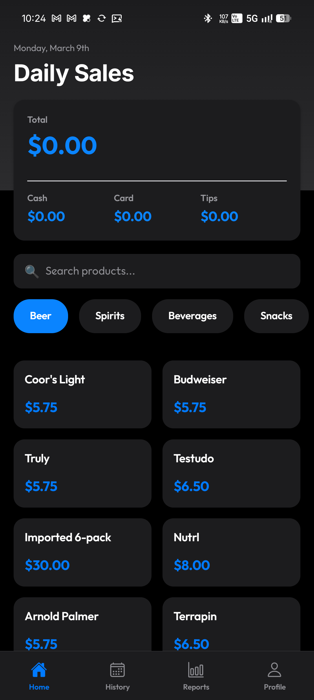
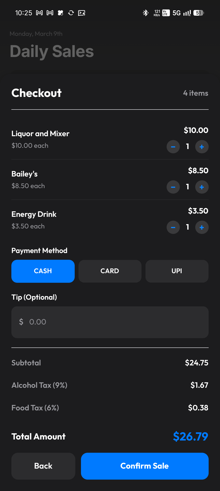
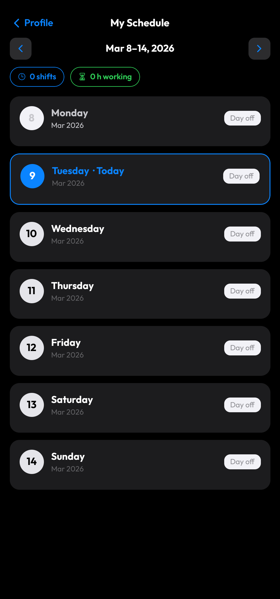
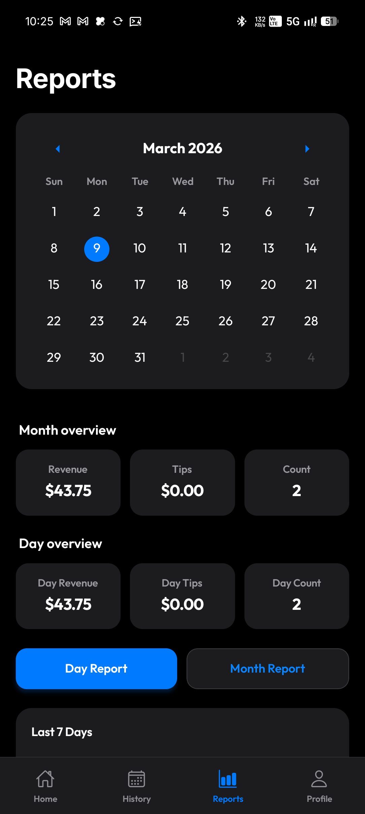
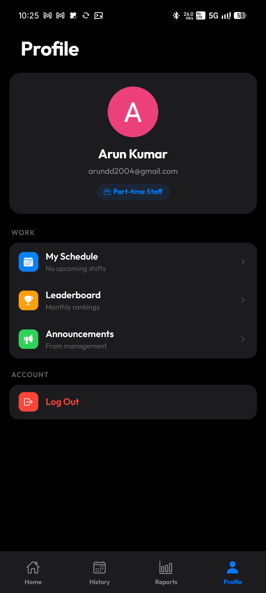
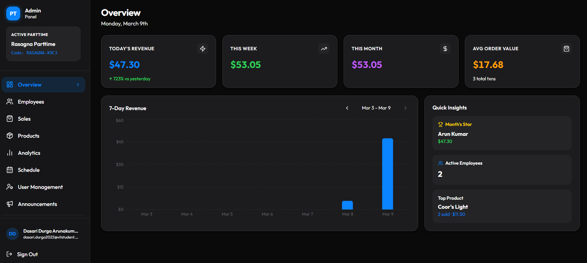
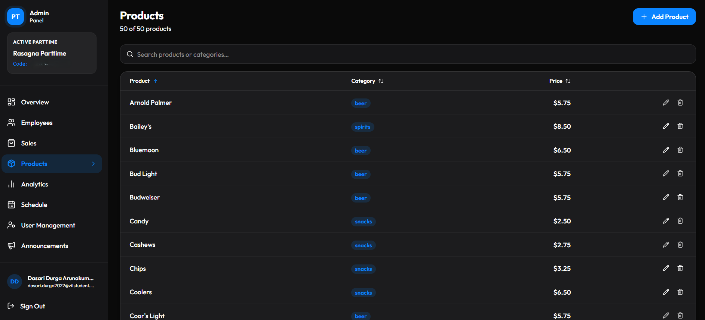
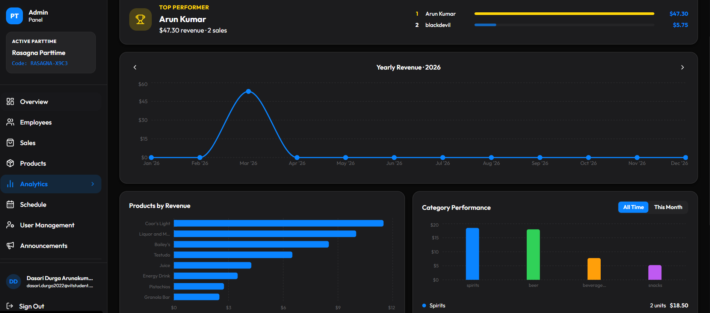

<div align="center">
  
  <h1>SyncStore</h1>
  <p><strong>A Unified Point-of-Sale & Employee Management Platform</strong></p>
  
  <p>
    <a href="#features">Features</a> •
    <a href="#architecture">Architecture</a> •
    <a href="#screenshots">Screenshots</a> •
    <a href="#getting-started">Getting Started</a>
  </p>
</div>

---

## 📖 Overview

SyncStore is a dual-platform system designed to streamline retail and part-time business operations. It provides a robust **React Native mobile application** for point-of-sale and employee access, paired with a comprehensive **Next.js web dashboard** for high-level administrative control, inventory management, and analytics.

## ✨ Features

### 📱 Staff Mobile Experience (`/mobile`)
Designed as a POS terminal and a daily companion for employees.
- **Fast POS & Cart:** Browse inventory, adjust quantities, and process transactions with dynamic, category-specific tax calculations.
- **Schedule Sync:** Employees have direct visibility into their upcoming shifts.
- **Performance Gamification:** An integrated leaderboard tracks sales metrics to encourage friendly competition and performance.
- **Company Announcements:** A built-in broadcast system ensures staff see important updates, with synchronized unread badges.
- **Secure Access Control:** A request-based sign-up system ensures only verified staff gain access to the platform. 

### 💻 Admin Dashboard (`/admin`)
The control center for managers and owners to oversee operations.
- **Business Operations:** Complete CRUD functionality for product listings, categories, and stock management.
- **Workforce Management:** Review and approve access requests, manage system roles, and curate the employee whitelist.
- **Sales Analytics:** Visual data tracking for revenue trends, top-selling items, and essential KPIs.
- **Broadcast Hub:** Post system-wide announcements directly to staff mobile devices.

## 🏗️ Architecture Stack

Both applications are seamlessly connected via **Firebase**, utilizing Firebase Authentication for secure identity management and Cloud Firestore for real-time database persistence. 

| Platform | Technology Stack | Purpose |
| :--- | :--- | :--- |
| **Mobile App** | React Native, Expo Router, TypeScript | Staff interface, POS, schedules |
| **Web Admin** | Next.js, Node.js, Tailwind CSS | Management, CMS, Data Analytics |
| **Backend** | Firebase Auth, Firestore | Database, Auth, Cloud functions |

## 📸 Screenshots

### Mobile Terminals
<p align="center">
  
  
  
</p>
<p align="center">
  
  
  
</p>

### Admin Control Center
<p align="center">
  
</p>
<p align="center">
  
  
</p>

## 🚀 Getting Started

Follow these instructions to get both environments running locally.

### 1. Clone the repository
```bash
git clone https://github.com/ArunaK-netizen/SyncStore.git
cd SyncStore
```

### 2. Environment Configuration
Because this project utilizes Firebase, you must manual provide configuration credentials that are kept out of version control for security.

**Mobile App (`/mobile`)**
1. Generate a `google-services.json` file for Android from your Firebase Console.
2. Place this file directly in the root of the `/mobile` directory.

**Admin Dashboard (`/admin`)**
1. Copy the template environment variables:
   ```bash
   cd admin
   cp .env.example .env.local
   ```
2. Open `.env.local` and populate it with your Firebase Web configuration details.
3. *(Optional)* If you are utilizing server-side Firebase Admin features, ensure your `serviceAccountKey.json` from the Firebase console is placed in the root of the `/admin` directory.

### 3. Running the Applications

**Run the Mobile POS App**
```bash
cd mobile
npm install
npx expo start
```

**Run the Web Dashboard**
```bash
cd admin
npm install
npm run dev
```
